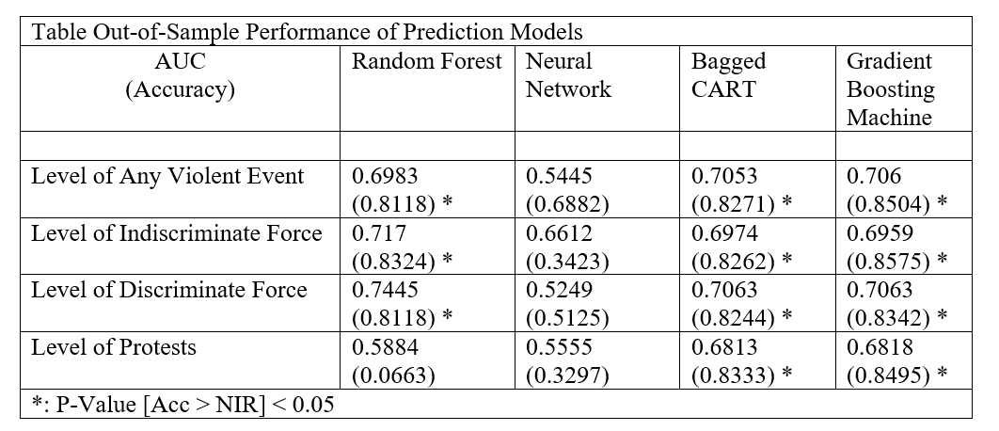

author: "Zhang"
date: "3/30/2020"
output: pdf_document
---

# Introduction:
This project attempts to predict subnational political conflict with variables that are available ex-ante. Essentially, we use machine learning models to predict future conflict based on variables that are slow-moving or otherwise knowable to forecasters. Previous studies have mainly used large scale, country-level events, including coups, civil wars, and terror attacks. We use subnational data conflict event data aggregated into division-month panel to train and test the performance of random forest, neural networks, and ensemble models in making ex-ante predictions.

Specifically, we are interested in predicting four outcomes:  
1.    Any violent conflict event, including battle/discriminate and indiscriminate attacks+

2.    Indiscriminate use of force, including remote violence, shelling, airstrikes
3.    Discriminate use of force, including firefights, arrests, assassinations
4.    Protests


## Features: economic value, insurgent opportunity, and prior conflict in the neighborhood.
### Economic Variables.
A recent study on sub-national political violence suggests that local economic value, climate, and insurgent opportunities are risk factors that can help predict the occurrence of political violence. First, resources such as oil and diamond have a positive correlation with the probability of civil war onset (Buhaug, Gates, & Lujala, 2009; Lujala, Gleditsch, & Gilmore, 2005). Therefore, the number of the oil field in which division includes a predictor. Second, economic development, in general, might affect the level of conflict. Some study suggests that higher income level raises the opportunity cost of rebellion, making violent conflict less likely (Nordhaus, 2006). Given the infrequency and a lack of spatially disaggregated economic indicators, the yearly average nightlight measure from Version 4 DMSP-OLS Nighttime Lights Time Series dataset is included as a proxy for economic development. Third, Unmitigated abnormal climate patterns, such as drought, can exacerbate social and economic disputes, which, in turn, increase the probability of communal and anti-government violence (Detges, 2016; Hendrix & Salehyan, 2012). To incorporate climate risk factors, monthly rainfall data is included as one of the features.

### Opportunities:
Inaccessible terrain provides space for insurgent groups that usually cannot face government troops on the open battlefield to survive. A number of studies have shown mountainous terrain predicts a high level of sub-national conflict (Bazzi et al., 2019; Fearon & Laitin, 2016; Tollefsen et al., 2012) Six features are included to capture the inaccessibility of a location. These include the average elevation of the locality, percentage of open-terrain, percentage of the locality that is covered by forest, wetland, and road density in the area. Since state capacity to exert control might be weaker in more remote divisions, division centroid’s distance to the nearest provincial capital is also included as a predictor. Another source of sub-national conflict is the ethnic makeup of the division. Northwestern Pakistan and particularly the Pashto-speaking Federally Administered Tribal Areas that borders Afghanistan, is known to be a conflict hotspot. Thus, the number of ethnic groups in a given division is included as a predictor of conflict.


### Neighborhood Factors:

The quantitative study of international and civil war has shown that repeatedly shown that violence has a pattern of path-dependency. Conflict histories are strong predictors of future conflict (Bazzi et al., 2019). Based on the existing literature, we include the conflict event count in the same division in the previous month as a measurement of violence history. We also use the history of conflict in neighboring divisions as a predictor. Specifically, we calculated the total number of similar conflict events that occurred in neighboring divisions during the prior month. Therefore, we use past events to account for this type of path-dependency and potential diffusion of violence from one region to another.

It is reasonable to assume that the province where a division is located can provide useful information on the level of conflict risk in that division---for instance, a division in F.A.T.A or Azad Kashmir area would have a high risk of conflict due to their proximity to Afghanistan and disputed Kashmir. 

### Lagged Dependent Variables
Consistent with the literature, we also use the lagged dependent variables as a predictor. We calculate the total number of similar conflict events that occurred in a division during the prior month. In other words, we use past events to account for this type of path-dependency and potential diffusion of violence from one-time to another for a particular division.

It is worth noting that all features used in this prediction project are metrics that are realistically available to policymakers who want to make ex-ante predictions. For one, most of the features used for prediction are not time-varying in the short term. For example, we can assume there are little short-term changes to the terrain of an administrative division from month to month. Meteorological predictors such as rainfall follow a predictable seasonal pattern and can be predicted ex-ante. Moreover, another feature, such as the conflict event in the previous month, is also a metric that should also be available to policymakers. 

### Setup
```{r setup, include=FALSE}
knitr::opts_chunk$set(echo = TRUE)
```


```{r,echo=FALSE,message=FALSE,warning=FALSE}
library(knitr)
hook_output = knit_hooks$get('source')  #this is the output for code

knit_hooks$set(source = function(x, options) {
  # use if the output is PDF and you set an option linewidth to e.g. 70
  # in the chunk options
  if (!is.null(n <- options$linewidth) & knitr::is_latex_output()) {
    x <- strwrap(x, width = n, exdent = 4)
  }
  hook_output(x, options)
})
```


#Data

To implement this, we use two data sources: First, we use an aggregated multi-source conflict dataset on Violence in Pakistan; Second, we use ACLED division-month dataset. We transformed the datasets to include lagged dependent variables and lagged neighborhood violence measures. 

The first is an aggregated multi-source conflict dataset on Violence in Pakistan. The event data sources include ACLED, BFRS Political Violence in Pakistan Dataset, WITS Pakistan dataset, UCDP GED event dataset, and Political Instability Task-Force data. These event data are aggregated into the event count database on their location and time.

The unit of aggregation in this first dataset used is PRIO-grid-month. PRIO-grid cells are 0.5 ×0.5 decimal degree square cells that cover a 50 × 50 kilometer area approximately the size of Madison, Wisconsin (Tollefsen, Strand, & Buhaug, 2012). All events occurred within the same cell during the same month will be aggregated into event counts of varies type using the Matching Event Data by Location, Time and Type (MELTT) package (Donnay, Dunford, Mcgrath, Backer, & Cunningham, 2019, Zhukov, Davenport, & Kostyuk, 2019). The grid-month dataset covers the 357 months between January 1988 and September 2017. There are 408 grid cells in Pakistan. Thus, the dataset has 145,656 observations.

The second ACLED division-month dataset used in the following analysis uses a more aggregated division-month unit. Division is an administrative unit in Pakistan that is below the level of province and above the level of districts. There are 31 divisions, 120 months covering the period between January 2010 and December 2019, 3720 observations in total. Though covering a shorter period of time at a more spatially aggregated level, the ACLED division-month dataset turns out to be a more effective data for model training for two reasons. First, the grid-month data is too disaggregated to be useful. First, as shown in the event count density plot, because there is usually no conflict event occurrence in a grid cell during a given month, the data is highly sparse. The mean of event count in grid-month data is only 0.24 compared to 14.27 of the division-month data. Second, the multi-source dataset suffers from the inconsistency of data coverage and event inclusion. For instance, ACLED only covers the period between 2010-2019, while BFRS data cover the period between 1988-2011. Moreover, ACLED includes more events than BFRS. As a result, the aggregated event counts in multi-source data reflect dataset differences rather than the actual level of violence. To that end, the following analysis will focus exclusively on the division-month data.


### ACLED division-month dataset Data Cleaning Code

```{r, eval=FALSE}
library(tidyverse)
library(lubridate)
library(caret)
library(randomForest)
library(tree)

# =====================Load data and recode date variable=====================
pak.division.mo <- read_csv("xSub_ACLED_PAK_adm2_month.csv")

pak.division.mo$month <- substring(pak.division.mo$YRMO, 5, 6)

pak.division.mo$day <- "01"

pak.division.mo$DATE <- as.Date(paste(pak.division.mo$YEAR, pak.division.mo$month,
                                      pak.division.mo$day, sep = "-"))
pak.division.mo$last_month <- pak.division.mo$DATE %m-% months(1)


# ============================================================================


# =====================Identify Neighboring districts=====================
divisions<- unique(pak.division.mo$NAME_2) # there are 31 districts 
length(unique(pak.division.mo$YRMO))

# [1] "Azad Kashmir"     "Kalat"            "Makran"           "Nasirabad"        "Quetta"           "Sibi"            
# [7] "Zhob"             "F.A.T.A."         "Islamabad"        "Bannu"            "Dera Ismail Khan" "Hazara"          
# [13] "Kohat"            "Malakand"         "Mardan"           "Peshawar"         "Northern Areas"   "Bahawalpur"      
# [19] "Dera Ghazi Khan"  "Faisalabad"       "Gujranwala"       "Lahore"           "Multan"           "Rawalpindi"      
# [25] "Sargodha"         "Hyderabad"        "Karachi"          "Larkana"          "Mirpur Khas"      "Rann of Kutch"   
# [31] "Sukkur"      

#http://www.columbia.edu/itc/mealac/pritchett/00maplinks/modern/pakadmin/pakadmin.jpg 

n_Azad_Kashmir <- c("Northern Areas", "Hazara", "Rawalpindi","Gujranwala")
n_Kalat <- c("Quetta", "Makran", "Karachi", "Hyderabad", "Larkana","Nasirabad", "Sibi")
n_Makran <- c("Kalat")
n_Nasirabad <- c("Kalat", "Sibi", "Larkana")
n_Quetta <- c("Kalat", "Sibi", "Zhob")
n_Sibi <- c("Quetta","Kalat", "Nasirabad", "Larkana", "Dera Ghazi Khan", "Zhob")
n_Zhob <- c("Quetta", "Sibi", "Dera Ghazi Khan", "F.A.T.A.")
n_F.A.T.A. <- c("Zhob", "Dera Ghazi Khan", "Dera Ismail Khan","Bannu", "Kohat", "Peshawar", "Malakand")
n_Islamabad <- c("Rawalpindi", "Hazara")
n_Bannu <- c("F.A.T.A.", "Dera Ismail Khan", "Sargodha", "Kohat")
n_Dera_Ismail_Khan <- c("F.A.T.A.","Dera Ghazi Khan","Sargodha","Bannu")
n_Hazara <- c("Malakand", "Mardan", "Rawalpindi", "Azad Kashmir", "Northern Areas")
n_Kohat <- c("F.A.T.A.", "Bannu", "Sargodha","Rawalpindi","Peshawar")
n_Malakand <-c("F.A.T.A.", "Peshawar","Mardan", "Hazara", "Northern Areas")
n_Mardan <- c("Malakand", "Peshawar", "Rawalpindi","Hazara")
n_Peshawar <- c("F.A.T.A.", "Kohat", "Rawalpindi", "Mardan","Malakand")
n_Northern_Areas <- c("Malakand", "Hazara", "Azad Kashmir")
n_Bahawalpur <-c("Dera Ghazi Khan", "Sukkur", "Multan", "Lahore")
n_Dera_Ghazi_Khan <- c("Zhob", "Sibi", "Larkana", "Sukkur", "Bahawalpur", "Multan", "Faisalabad", "Sargodha", "Dera Ismail Khan", "F.A.T.A.")
n_Faisalabad <- c("Sargodha", "Dera Ghazi Khan","Multan","Lahore","Gujranwala")
n_Gujranwala <- c("Rawalpindi", "Sargodha","Faisalabad","Lahore","Azad Kashmir")
n_Lahore <- c("Gujranwala","Faisalabad","Multan","Bahawalpur")
n_Multan <-c("Dera Ghazi Khan","Bahawalpur","Lahore","Faisalabad")
n_Rawalpindi <- c("Hazara", "Mardan", "Peshawar", "Kohat", "Sargodha", "Gujranwala", "Azad Kashmir")
n_Sargodha <- c("Kohat","Bannu","Dera Ismail Khan", "Dera Ismail Khan", "Faisalabad", "Gujranwala","Rawalpindi")
n_Hyderabad <- c("Kalat", "Karachi", "Mirpur Khas", "Sukkur", "Larkana")
n_Karachi <- c("Kalat", "Hyderabad")
n_Larkana <- c("Sibi", "Nasirabad", "Kalat", "Hyderabad", "Sukkur", "Bahawalpur", "Dera Ismail Khan")
n_Mirpur_Khas <- c("Hyderabad", "Sukkur")
n_Rann_of_Kutch<-c("Hyderabad", "Mirpur Khas")
n_Sukkur<-c("Larkana", "Hyderabad","Mirpur Khas","Bahawalpur","Dera Ghazi Khan")

#NA padding of neighbor vectors
length(n_Azad_Kashmir) <- 10
length(n_Kalat) <- 10
length(n_Makran) <- 10
length(n_Nasirabad) <- 10
length(n_Quetta) <-10
length(n_Sibi) <- 10
length(n_Zhob) <- 10
length(n_F.A.T.A.) <-10
length(n_Islamabad) <- 10
length(n_Bannu) <- 10
length(n_Dera_Ismail_Khan) <- 10
length(n_Hazara) <- 10
length(n_Kohat) <- 10
length(n_Malakand) <-10
length(n_Mardan) <- 10
length(n_Peshawar) <- 10
length(n_Northern_Areas) <- 10
length(n_Bahawalpur) <-10
length(n_Dera_Ghazi_Khan) <- 10
length(n_Faisalabad) <- 10
length(n_Gujranwala) <- 10
length(n_Lahore) <-10
length(n_Multan) <-10
length(n_Rawalpindi) <- 10
length(n_Sargodha) <- 10
length(n_Hyderabad) <- 10
length(n_Karachi) <- 10
length(n_Larkana) <-10
length(n_Mirpur_Khas) <- 10
length(n_Rann_of_Kutch) <-10
length(n_Sukkur) <-10

neighbors<- rbind(n_Azad_Kashmir, n_Kalat, n_Makran, n_Nasirabad, n_Quetta, n_Sibi, n_Zhob, n_F.A.T.A., n_Islamabad,n_Bannu,
      n_Dera_Ismail_Khan, n_Hazara, n_Kohat, n_Malakand, n_Mardan, n_Peshawar, n_Northern_Areas, n_Bahawalpur, n_Dera_Ghazi_Khan,
      n_Faisalabad, n_Gujranwala, n_Lahore, n_Multan, n_Rawalpindi,n_Sargodha, n_Hyderabad,n_Karachi, n_Larkana,n_Mirpur_Khas,
      n_Rann_of_Kutch, n_Sukkur); neighbors <- data.frame(neighbors)


names(neighbors) <- c(paste("n", seq(1:10), sep = "_"))

neighbors$NAME_2 <- substring(rownames(neighbors),3); neighbors$NAME_2<-gsub(pattern = "_", replacement = " ",x= neighbors$NAME_2) #create a dataframe with neighbors of each divisions

pak.division.mo.n <- left_join(pak.division.mo, neighbors, by = "NAME_2")

table(pak.division.mo.n$NAME_1, pak.division.mo.n$NAME_2)

tdf <- dplyr::filter(pak.division.mo.n, NAME_1 =="N.W.F.P." & NAME_2 == "F.A.T.A.") # remove duplicates of Federally Administered Tribal Areas coded as being in North-West Frontier Province

pak.division.mo.n.c <- anti_join(pak.division.mo.n, tdf)              

table(pak.division.mo.n.c$NAME_1, pak.division.mo.n.c$NAME_2) 


# ===================== finding neighbor's covarites ======

n_1_covarites<-data.frame()
for (i in 1:nrow(pak.division.mo.n.c)) {
  d <- if(dim(dplyr::filter(pak.division.mo.n.c, NAME_2 == pak.division.mo.n.c$n_1[i] & DATE == pak.division.mo.n.c$last_month[i]))[1] ==0) data.frame(NA) else dplyr::filter(pak.division.mo.n.c, NAME_2 == pak.division.mo.n.c$n_1[i] & DATE == pak.division.mo.n.c$last_month[i])
  n_1_covarites<-bind_rows(n_1_covarites, d)
}


n_2_covarites<-data.frame()
for (i in 1:nrow(pak.division.mo.n.c)) {
  d <- if(dim(dplyr::filter(pak.division.mo.n.c, NAME_2 == pak.division.mo.n.c$n_2[i] & DATE == pak.division.mo.n.c$last_month[i]))[1] ==0) data.frame(NA) else dplyr::filter(pak.division.mo.n.c, NAME_2 == pak.division.mo.n.c$n_2[i] & DATE == pak.division.mo.n.c$last_month[i])
  n_2_covarites<-bind_rows(n_2_covarites, d)
}

n_3_covarites<-data.frame()
for (i in 1:nrow(pak.division.mo.n.c)) {
  d <- if(dim(dplyr::filter(pak.division.mo.n.c, NAME_2 == pak.division.mo.n.c$n_3[i] & DATE == pak.division.mo.n.c$last_month[i]))[1] ==0) data.frame(NA) else dplyr::filter(pak.division.mo.n.c, NAME_2 == pak.division.mo.n.c$n_3[i] & DATE == pak.division.mo.n.c$last_month[i])
  n_3_covarites<-bind_rows(n_3_covarites, d)
}

n_4_covarites<-data.frame()
for (i in 1:nrow(pak.division.mo.n.c)) {
  d <- if(dim(dplyr::filter(pak.division.mo.n.c, NAME_2 == pak.division.mo.n.c$n_4[i] & DATE == pak.division.mo.n.c$last_month[i]))[1] ==0) data.frame(NA) else dplyr::filter(pak.division.mo.n.c, NAME_2 == pak.division.mo.n.c$n_4[i] & DATE == pak.division.mo.n.c$last_month[i])
  n_4_covarites<-bind_rows(n_4_covarites, d)
}

n_5_covarites<-data.frame()
for (i in 1:nrow(pak.division.mo.n.c)) {
  d <- if(dim(dplyr::filter(pak.division.mo.n.c, NAME_2 == pak.division.mo.n.c$n_5[i] & DATE == pak.division.mo.n.c$last_month[i]))[1] ==0) data.frame(NA) else dplyr::filter(pak.division.mo.n.c, NAME_2 == pak.division.mo.n.c$n_5[i] & DATE == pak.division.mo.n.c$last_month[i])
  n_5_covarites<-bind_rows(n_5_covarites, d)
}


n_6_covarites<-data.frame()
for (i in 1:nrow(pak.division.mo.n.c)) {
  d <- if(dim(dplyr::filter(pak.division.mo.n.c, NAME_2 == pak.division.mo.n.c$n_6[i] & DATE == pak.division.mo.n.c$last_month[i]))[1] ==0) data.frame(NA) else dplyr::filter(pak.division.mo.n.c, NAME_2 == pak.division.mo.n.c$n_6[i] & DATE == pak.division.mo.n.c$last_month[i])
  n_6_covarites<-bind_rows(n_6_covarites, d)
}

n_7_covarites<-data.frame()
for (i in 1:nrow(pak.division.mo.n.c)) {
  d <- if(dim(dplyr::filter(pak.division.mo.n.c, NAME_2 == pak.division.mo.n.c$n_7[i] & DATE == pak.division.mo.n.c$last_month[i]))[1] ==0) data.frame(NA) else dplyr::filter(pak.division.mo.n.c, NAME_2 == pak.division.mo.n.c$n_7[i] & DATE == pak.division.mo.n.c$last_month[i])
  n_7_covarites<-bind_rows(n_7_covarites, d)
}

n_8_covarites<-data.frame()
for (i in 1:nrow(pak.division.mo.n.c)) {
  d <- if(dim(dplyr::filter(pak.division.mo.n.c, NAME_2 == pak.division.mo.n.c$n_8[i] & DATE == pak.division.mo.n.c$last_month[i]))[1] ==0) data.frame(NA) else dplyr::filter(pak.division.mo.n.c, NAME_2 == pak.division.mo.n.c$n_8[i] & DATE == pak.division.mo.n.c$last_month[i])
  n_8_covarites<-bind_rows(n_8_covarites, d)
}

n_9_covarites<-data.frame()
for (i in 1:nrow(pak.division.mo.n.c)) {
  d <- if(dim(dplyr::filter(pak.division.mo.n.c, NAME_2 == pak.division.mo.n.c$n_9[i] & DATE == pak.division.mo.n.c$last_month[i]))[1] ==0) data.frame(NA) else dplyr::filter(pak.division.mo.n.c, NAME_2 == pak.division.mo.n.c$n_9[i] & DATE == pak.division.mo.n.c$last_month[i])
  n_9_covarites<-bind_rows(n_9_covarites, d)
}


n_10_covarites<-data.frame()
for (i in 1:nrow(pak.division.mo.n.c)) {
  d <- if(dim(dplyr::filter(pak.division.mo.n.c, NAME_2 == pak.division.mo.n.c$n_10[i] & DATE == pak.division.mo.n.c$last_month[i]))[1] ==0) data.frame(NA) else dplyr::filter(pak.division.mo.n.c, NAME_2 == pak.division.mo.n.c$n_10[i] & DATE == pak.division.mo.n.c$last_month[i])
  n_10_covarites<-bind_rows(n_10_covarites, d)
}

names(n_1_covarites)= paste("n_1", names(n_1_covarites), sep = "-"); n_1_covarites <- n_1_covarites[-1]

names(n_2_covarites)= paste("n_2", names(n_2_covarites), sep = "-"); n_2_covarites <- n_2_covarites[-1]

names(n_3_covarites)= paste("n_3", names(n_3_covarites), sep = "-"); n_3_covarites <- n_3_covarites[-1]

names(n_4_covarites)= paste("n_4", names(n_4_covarites), sep = "-"); n_4_covarites <- n_4_covarites[-1]

names(n_5_covarites)= paste("n_5", names(n_5_covarites), sep = "-"); n_5_covarites <- n_5_covarites[-1]

names(n_6_covarites)= paste("n_6", names(n_6_covarites), sep = "-"); n_6_covarites <- n_6_covarites[-1]

names(n_7_covarites)= paste("n_7", names(n_7_covarites), sep = "-"); n_7_covarites <- n_7_covarites[-1]

names(n_8_covarites)= paste("n_8", names(n_8_covarites), sep = "-"); n_8_covarites <- n_8_covarites[-1]

names(n_9_covarites)= paste("n_9", names(n_9_covarites), sep = "-"); n_9_covarites <- n_9_covarites[-1]

names(n_10_covarites)= paste("n_10", names(n_10_covarites), sep = "-"); n_10_covarites <- n_10_covarites[-1]


pak.division.mo.cleaned.wide <- cbind(pak.division.mo.n.c, n_1_covarites, n_2_covarites, n_3_covarites, n_4_covarites, n_5_covarites, n_6_covarites,
                                 n_7_covarites, n_8_covarites, n_9_covarites, n_10_covarites)

pak.division.mo.cleaned.wide$near.tot.ACTION_ANY <- ifelse(is.na(pak.division.mo.cleaned.wide$`n_1-ACTION_ANY`), 0, pak.division.mo.cleaned.wide$`n_1-ACTION_ANY`)+
  ifelse(is.na(pak.division.mo.cleaned.wide$`n_2-ACTION_ANY`), 0, pak.division.mo.cleaned.wide$`n_2-ACTION_ANY`)+
  ifelse(is.na(pak.division.mo.cleaned.wide$`n_3-ACTION_ANY`), 0, pak.division.mo.cleaned.wide$`n_3-ACTION_ANY`)+
  ifelse(is.na(pak.division.mo.cleaned.wide$`n_4-ACTION_ANY`), 0, pak.division.mo.cleaned.wide$`n_4-ACTION_ANY`)+
  ifelse(is.na(pak.division.mo.cleaned.wide$`n_5-ACTION_ANY`), 0, pak.division.mo.cleaned.wide$`n_5-ACTION_ANY`)+
  ifelse(is.na(pak.division.mo.cleaned.wide$`n_6-ACTION_ANY`), 0, pak.division.mo.cleaned.wide$`n_6-ACTION_ANY`)+
  ifelse(is.na(pak.division.mo.cleaned.wide$`n_7-ACTION_ANY`), 0, pak.division.mo.cleaned.wide$`n_7-ACTION_ANY`)+
  ifelse(is.na(pak.division.mo.cleaned.wide$`n_8-ACTION_ANY`), 0, pak.division.mo.cleaned.wide$`n_8-ACTION_ANY`)+
  ifelse(is.na(pak.division.mo.cleaned.wide$`n_9-ACTION_ANY`), 0, pak.division.mo.cleaned.wide$`n_9-ACTION_ANY`)+
  ifelse(is.na(pak.division.mo.cleaned.wide$`n_10-ACTION_ANY`), 0, pak.division.mo.cleaned.wide$`n_10-ACTION_ANY`)

pak.division.mo.cleaned.wide$near.tot.INITIATOR_SIDEA <- ifelse(is.na(pak.division.mo.cleaned.wide$`n_1-INITIATOR_SIDEA`), 0, pak.division.mo.cleaned.wide$`n_1-INITIATOR_SIDEA`)+
  ifelse(is.na(pak.division.mo.cleaned.wide$`n_2-INITIATOR_SIDEA`), 0, pak.division.mo.cleaned.wide$`n_2-INITIATOR_SIDEA`)+
  ifelse(is.na(pak.division.mo.cleaned.wide$`n_3-INITIATOR_SIDEA`), 0, pak.division.mo.cleaned.wide$`n_3-INITIATOR_SIDEA`)+
  ifelse(is.na(pak.division.mo.cleaned.wide$`n_4-INITIATOR_SIDEA`), 0, pak.division.mo.cleaned.wide$`n_4-INITIATOR_SIDEA`)+
  ifelse(is.na(pak.division.mo.cleaned.wide$`n_5-INITIATOR_SIDEA`), 0, pak.division.mo.cleaned.wide$`n_5-INITIATOR_SIDEA`)+
  ifelse(is.na(pak.division.mo.cleaned.wide$`n_6-INITIATOR_SIDEA`), 0, pak.division.mo.cleaned.wide$`n_6-INITIATOR_SIDEA`)+
  ifelse(is.na(pak.division.mo.cleaned.wide$`n_7-INITIATOR_SIDEA`), 0, pak.division.mo.cleaned.wide$`n_7-INITIATOR_SIDEA`)+
  ifelse(is.na(pak.division.mo.cleaned.wide$`n_8-INITIATOR_SIDEA`), 0, pak.division.mo.cleaned.wide$`n_8-INITIATOR_SIDEA`)+
  ifelse(is.na(pak.division.mo.cleaned.wide$`n_9-INITIATOR_SIDEA`), 0, pak.division.mo.cleaned.wide$`n_9-INITIATOR_SIDEA`)+
  ifelse(is.na(pak.division.mo.cleaned.wide$`n_10-INITIATOR_SIDEA`), 0, pak.division.mo.cleaned.wide$`n_10-INITIATOR_SIDEA`)

pak.division.mo.cleaned.wide$near.tot.INITIATOR_SIDEB <- ifelse(is.na(pak.division.mo.cleaned.wide$`n_1-INITIATOR_SIDEB`), 0, pak.division.mo.cleaned.wide$`n_1-INITIATOR_SIDEB`)+
  ifelse(is.na(pak.division.mo.cleaned.wide$`n_2-INITIATOR_SIDEB`), 0, pak.division.mo.cleaned.wide$`n_2-INITIATOR_SIDEB`)+
  ifelse(is.na(pak.division.mo.cleaned.wide$`n_3-INITIATOR_SIDEB`), 0, pak.division.mo.cleaned.wide$`n_3-INITIATOR_SIDEB`)+
  ifelse(is.na(pak.division.mo.cleaned.wide$`n_4-INITIATOR_SIDEB`), 0, pak.division.mo.cleaned.wide$`n_4-INITIATOR_SIDEB`)+
  ifelse(is.na(pak.division.mo.cleaned.wide$`n_5-INITIATOR_SIDEB`), 0, pak.division.mo.cleaned.wide$`n_5-INITIATOR_SIDEB`)+
  ifelse(is.na(pak.division.mo.cleaned.wide$`n_6-INITIATOR_SIDEB`), 0, pak.division.mo.cleaned.wide$`n_6-INITIATOR_SIDEB`)+
  ifelse(is.na(pak.division.mo.cleaned.wide$`n_7-INITIATOR_SIDEB`), 0, pak.division.mo.cleaned.wide$`n_7-INITIATOR_SIDEB`)+
  ifelse(is.na(pak.division.mo.cleaned.wide$`n_8-INITIATOR_SIDEB`), 0, pak.division.mo.cleaned.wide$`n_8-INITIATOR_SIDEB`)+
  ifelse(is.na(pak.division.mo.cleaned.wide$`n_9-INITIATOR_SIDEB`), 0, pak.division.mo.cleaned.wide$`n_9-INITIATOR_SIDEB`)+
  ifelse(is.na(pak.division.mo.cleaned.wide$`n_10-INITIATOR_SIDEB`), 0, pak.division.mo.cleaned.wide$`n_10-INITIATOR_SIDEB`)

pak.division.mo.cleaned.wide$near.tot.TARGET_SIDED <- ifelse(is.na(pak.division.mo.cleaned.wide$`n_1-TARGET_SIDED`), 0, pak.division.mo.cleaned.wide$`n_1-TARGET_SIDED`)+
  ifelse(is.na(pak.division.mo.cleaned.wide$`n_2-TARGET_SIDED`), 0, pak.division.mo.cleaned.wide$`n_2-TARGET_SIDED`)+
  ifelse(is.na(pak.division.mo.cleaned.wide$`n_3-TARGET_SIDED`), 0, pak.division.mo.cleaned.wide$`n_3-TARGET_SIDED`)+
  ifelse(is.na(pak.division.mo.cleaned.wide$`n_4-TARGET_SIDED`), 0, pak.division.mo.cleaned.wide$`n_4-TARGET_SIDED`)+
  ifelse(is.na(pak.division.mo.cleaned.wide$`n_5-TARGET_SIDED`), 0, pak.division.mo.cleaned.wide$`n_5-TARGET_SIDED`)+
  ifelse(is.na(pak.division.mo.cleaned.wide$`n_6-TARGET_SIDED`), 0, pak.division.mo.cleaned.wide$`n_6-TARGET_SIDED`)+
  ifelse(is.na(pak.division.mo.cleaned.wide$`n_7-TARGET_SIDED`), 0, pak.division.mo.cleaned.wide$`n_7-TARGET_SIDED`)+
  ifelse(is.na(pak.division.mo.cleaned.wide$`n_8-TARGET_SIDED`), 0, pak.division.mo.cleaned.wide$`n_8-TARGET_SIDED`)+
  ifelse(is.na(pak.division.mo.cleaned.wide$`n_9-TARGET_SIDED`), 0, pak.division.mo.cleaned.wide$`n_9-TARGET_SIDED`)+
  ifelse(is.na(pak.division.mo.cleaned.wide$`n_10-TARGET_SIDED`), 0, pak.division.mo.cleaned.wide$`n_10-TARGET_SIDED`)

pak.division.mo.cleaned.wide$near.tot.ACTION_IND <- ifelse(is.na(pak.division.mo.cleaned.wide$`n_1-ACTION_IND`), 0, pak.division.mo.cleaned.wide$`n_1-ACTION_IND`)+
  ifelse(is.na(pak.division.mo.cleaned.wide$`n_2-ACTION_IND`), 0, pak.division.mo.cleaned.wide$`n_2-ACTION_IND`)+
  ifelse(is.na(pak.division.mo.cleaned.wide$`n_3-ACTION_IND`), 0, pak.division.mo.cleaned.wide$`n_3-ACTION_IND`)+
  ifelse(is.na(pak.division.mo.cleaned.wide$`n_4-ACTION_IND`), 0, pak.division.mo.cleaned.wide$`n_4-ACTION_IND`)+
  ifelse(is.na(pak.division.mo.cleaned.wide$`n_5-ACTION_IND`), 0, pak.division.mo.cleaned.wide$`n_5-ACTION_IND`)+
  ifelse(is.na(pak.division.mo.cleaned.wide$`n_6-ACTION_IND`), 0, pak.division.mo.cleaned.wide$`n_6-ACTION_IND`)+
  ifelse(is.na(pak.division.mo.cleaned.wide$`n_7-ACTION_IND`), 0, pak.division.mo.cleaned.wide$`n_7-ACTION_IND`)+
  ifelse(is.na(pak.division.mo.cleaned.wide$`n_8-ACTION_IND`), 0, pak.division.mo.cleaned.wide$`n_8-ACTION_IND`)+
  ifelse(is.na(pak.division.mo.cleaned.wide$`n_9-ACTION_IND`), 0, pak.division.mo.cleaned.wide$`n_9-ACTION_IND`)+
  ifelse(is.na(pak.division.mo.cleaned.wide$`n_10-ACTION_IND`), 0, pak.division.mo.cleaned.wide$`n_10-ACTION_IND`)

pak.division.mo.cleaned.wide$near.tot.ACTION_DIR <- ifelse(is.na(pak.division.mo.cleaned.wide$`n_1-ACTION_DIR`), 0, pak.division.mo.cleaned.wide$`n_1-ACTION_DIR`)+
  ifelse(is.na(pak.division.mo.cleaned.wide$`n_2-ACTION_DIR`), 0, pak.division.mo.cleaned.wide$`n_2-ACTION_DIR`)+
  ifelse(is.na(pak.division.mo.cleaned.wide$`n_3-ACTION_DIR`), 0, pak.division.mo.cleaned.wide$`n_3-ACTION_DIR`)+
  ifelse(is.na(pak.division.mo.cleaned.wide$`n_4-ACTION_DIR`), 0, pak.division.mo.cleaned.wide$`n_4-ACTION_DIR`)+
  ifelse(is.na(pak.division.mo.cleaned.wide$`n_5-ACTION_DIR`), 0, pak.division.mo.cleaned.wide$`n_5-ACTION_DIR`)+
  ifelse(is.na(pak.division.mo.cleaned.wide$`n_6-ACTION_DIR`), 0, pak.division.mo.cleaned.wide$`n_6-ACTION_DIR`)+
  ifelse(is.na(pak.division.mo.cleaned.wide$`n_7-ACTION_DIR`), 0, pak.division.mo.cleaned.wide$`n_7-ACTION_DIR`)+
  ifelse(is.na(pak.division.mo.cleaned.wide$`n_8-ACTION_DIR`), 0, pak.division.mo.cleaned.wide$`n_8-ACTION_DIR`)+
  ifelse(is.na(pak.division.mo.cleaned.wide$`n_9-ACTION_DIR`), 0, pak.division.mo.cleaned.wide$`n_9-ACTION_DIR`)+
  ifelse(is.na(pak.division.mo.cleaned.wide$`n_10-ACTION_DIR`), 0, pak.division.mo.cleaned.wide$`n_10-ACTION_DIR`)

pak.division.mo.cleaned.wide$near.tot.ACTION_PRT <- ifelse(is.na(pak.division.mo.cleaned.wide$`n_1-ACTION_PRT`), 0, pak.division.mo.cleaned.wide$`n_1-ACTION_PRT`)+
  ifelse(is.na(pak.division.mo.cleaned.wide$`n_2-ACTION_PRT`), 0, pak.division.mo.cleaned.wide$`n_2-ACTION_PRT`)+
  ifelse(is.na(pak.division.mo.cleaned.wide$`n_3-ACTION_PRT`), 0, pak.division.mo.cleaned.wide$`n_3-ACTION_PRT`)+
  ifelse(is.na(pak.division.mo.cleaned.wide$`n_4-ACTION_PRT`), 0, pak.division.mo.cleaned.wide$`n_4-ACTION_PRT`)+
  ifelse(is.na(pak.division.mo.cleaned.wide$`n_5-ACTION_PRT`), 0, pak.division.mo.cleaned.wide$`n_5-ACTION_PRT`)+
  ifelse(is.na(pak.division.mo.cleaned.wide$`n_6-ACTION_PRT`), 0, pak.division.mo.cleaned.wide$`n_6-ACTION_PRT`)+
  ifelse(is.na(pak.division.mo.cleaned.wide$`n_7-ACTION_PRT`), 0, pak.division.mo.cleaned.wide$`n_7-ACTION_PRT`)+
  ifelse(is.na(pak.division.mo.cleaned.wide$`n_8-ACTION_PRT`), 0, pak.division.mo.cleaned.wide$`n_8-ACTION_PRT`)+
  ifelse(is.na(pak.division.mo.cleaned.wide$`n_9-ACTION_PRT`), 0, pak.division.mo.cleaned.wide$`n_9-ACTION_PRT`)+
  ifelse(is.na(pak.division.mo.cleaned.wide$`n_10-ACTION_PRT`), 0, pak.division.mo.cleaned.wide$`n_10-ACTION_PRT`)


pak.division.mo.cleaned.narrow <- pak.division.mo.cleaned.wide[c(1:116,1277:1283)]

# ============================================================================


# ==============================NA handling, Removing Near-zero-Variance features==============================
pak.division.mo.cleaned.wide.nna<- qdap::NAer(pak.division.mo.cleaned.wide, replace = -99999) #code missing values for modelling 
pak.division.mo.cleaned.narrow.nna<- qdap::NAer(pak.division.mo.cleaned.narrow, replace = -99999) #code missing values for modelling 


pak_nzv_wide <- pak.division.mo.cleaned.wide.nna[,-nearZeroVar(pak.division.mo.cleaned.wide.nna,freqCut = 99,uniqueCut=0.5)] # remove variables with zero or nearly zero variation.
pak_nzv_narrow <- pak.division.mo.cleaned.narrow.nna[,-nearZeroVar(pak.division.mo.cleaned.narrow.nna,freqCut = 99,uniqueCut=0.5)] # remove variables with zero or nearly zero variation.


pak_nzv_narrow[ , c(8:18,20,22,24,26:79,91:97)] <- apply(pak_nzv_narrow[ , c(8:18,20,22,24,26:79,91:97)], 2,            # Specify own function within apply
                    function(x) as.numeric(as.character(x)))


pak_nzv_narrow$DATE <- as.Date(pak_nzv_narrow$DATE, origin = "2010-01-01")
pak_nzv_narrow$last_month <- as.Date(pak_nzv_narrow$last_month)
pak_nzv_narrow$GREG_GROUPS <- as.factor(pak_nzv_narrow$GREG_GROUPS)
pak_nzv_narrow$WLMS_LANGS <- as.factor(pak_nzv_narrow$WLMS_LANGS)
pak_nzv_narrow$BUILTUP <- as.factor(pak_nzv_narrow$BUILTUP)
pak_nzv_narrow$PETRO <- as.factor(pak_nzv_narrow$PETRO)
pak_nzv_narrow$month <- NULL
pak_nzv_narrow$last_month <- NULL
pak_nzv_narrow$YRMO<-NULL
pak_nzv_narrow$ID_1<-NULL
pak_nzv_narrow$ID_2<-NULL


str(pak_nzv_narrow)

pak_nzv_narrow<- pak_nzv_narrow %>%
  group_by(NAME_2) %>%
  mutate(lag1.ACTION_ANY = dplyr::lag(ACTION_ANY, n = 1, default = NA),
         lag1.ACTION_IND = dplyr::lag(ACTION_IND, n = 1, default = NA),
         lag1.ACTION_DIR = dplyr::lag(ACTION_DIR, n = 1, default = NA),
         lag1.ACTION_PRT = dplyr::lag(ACTION_PRT, n = 1, default = NA))


pak_nzv_narrow[is.na(pak_nzv_narrow)] <- -99999 #replace NA in the first period with -99999


save(pak_nzv_narrow, file = "pak.div.mo.cleaned.RData") # near.near.tot.ACTION_ANY is the total number of violent event in all neighboring districts


```

### Loading libraries, dataset and plotting descriptive stats 
```{r}
# cbp1 <- c("#999999", "#E69F00", "#56B4E9", "#009E73",
#           "#F0E442", "#0072B2", "#D55E00", "#CC79A7")
library(randomForest) #for random forests
library(caret) # for CV folds and data splitting
library(ROCR) # for diagnostics and ROC plots/stats
library(pROC) # same as ROCRlibrary(stepPlr) # Firth’s logit implemented thru caret library
#library(doMC) # for using multiple processor cores for MAC
library(foreach) #Parallel Processing for PC
library(doParallel) #Parallel Processing for PC
library(xtable) # for writing Table 1 in Latex

library(cluster.datasets)
library(tidyverse)
library(gridExtra)
library(ggplot2)
library(lubridate)
library(tidyverse)
library(ggpubr)
#registerDoMC(cores=6)
load("pak.grid.cleaned.RData")

data_pak_grid<-pak.grid.cleaned
load("pak.div.mo.cleaned.RData")

data_pak<-pak_nzv_narrow

grid_event <- ggplot(data_pak_grid, aes(ACTION_ANY))+geom_histogram(stat="count") +
  ggtitle("Grid-Month Data")
mean(as.numeric(as.character(pak.grid.cleaned$ACTION_ANY)))

division_event <- ggplot(data_pak, aes(ACTION_ANY))+geom_histogram(stat="count") +
  ggtitle("Division-Month Data")
mean(pak_nzv_narrow$ACTION_ANY)

ggarrange(grid_event, division_event)
```

#Prediction Methods:

## Training and Testing
First, because of the goal of making conflict prediction, we separated training and testing data temporally rather than randomly. The data prior to 2017 (2604 observations) are used as the training set and the data in 2017-2019 are used as the testing set (1116 observations). To reduce the number of class, each of the four dependent variables are clustered into three levels using the k-means algorithm. Each cluster label represents the low, medium and high level of conflict in each event category. As shown in the plot below, the models will predict the cluster labels of an observation rather than the actual event count. We trained three types of model, random forest, neural network, and ensemble models (Tree bags, Gradient Boosting Machines). We use 10-fold cross validation, repeated twice to choose optimal hyperparameters for each model. The two metrics of model evaluation are (1) the accuracy of out of sample prediction relative to no information rate (NIR);  (2) the area under the Area Under the Receiver Operating Characteristics Curve (AUC). Given NIR is defined as the proportion of the majority/plurality class, we would get accuracy equal to NIR simply by classifying every observation as the majority/plurality class (Kuhn, 2008). An effective model should obviously outperform NIR. The accuracy metric tells use if the model doing better than simply using the overall mean to predict outcome. 


The AUC-ROC metric tells us if the model is capable of distinguishing between low, medium and high conflict class, with higher AUC, indicating better performance. For example, an AUC of 1 suggest that with a randomly chosen pair of observations, the model is able to perfectly classify both observations as high, low or medium risk. Because the outcome variable has three different classes, we use Hand and Till’s (2001) formula for multiclass AUC.

##Machine Learning Algorithms
###Random Forests.  
It is a model that comprises many independent decision trees, which is a sequence of rules that splits the sample into subsets. Each tree generates a prediction, and the final output is the average of the predictions from each tree.

###Neural Networks
This method consists of a system of nodes. Each node inputs a linear combination of predictors, and output generates a prediction. Finally, the output of these nodes is combined to produce a single output.

###Ensemble
An ensemble method is a technique that combines the predictions from multiple machine learning algorithms together to make more accurate predictions than any individual model.

####Bagging
Bootstrap aggregation method or Bagging creates random subsamples of the training set with replacement, training a classification and regression tree (CART) model on each subsample. Predictions are made by averaging the predictions from the individual CARTs.

####Gradient Boosted Machines
This method is a variant of Random Forests, where each tree is fitted sequentially. Essentially, the new tree puts larger weights on the observations that the previous tree found difficult to predict by weighting observations by error rates in the previous tree. Hence, each additional tree slightly improves the model.
###Loading libraries and dataset for model training and testing

```{r preprocessing, k-means clustering of dependent variables}
set.seed(6666)

cl <- makePSOCKcluster(5)
registerDoParallel(cl)

data_pak$year<-year(data_pak$DATE)


ActionCluster1<-kmeans(data_pak$ACTION_ANY,3, nstart = 25)
data_pak$cluster1<-factor(ActionCluster1$cluster)
levels(data_pak$cluster1)<-make.names(levels(data_pak$cluster1))
ActionCluster2<-kmeans(data_pak$ACTION_IND,3, nstart = 25)
data_pak$cluster2<-factor(ActionCluster2$cluster)
levels(data_pak$cluster2)<-make.names(levels(data_pak$cluster2))
ActionCluster3<-kmeans(data_pak$ACTION_DIR,3, nstart = 25)
data_pak$cluster3<-factor(ActionCluster3$cluster)
levels(data_pak$cluster3)<-make.names(levels(data_pak$cluster3))
ActionCluster4<-kmeans(data_pak$ACTION_PRT,3, nstart = 25)
data_pak$cluster4<-factor(ActionCluster4$cluster)
levels(data_pak$cluster4)<-make.names(levels(data_pak$cluster4))

data.train<-subset(data_pak,as.integer(year)<2017)
data.test<-subset(data_pak, year >= 2017)

any_cluster <- ggplot(data_pak, aes(ACTION_ANY,fill = cluster1))+geom_histogram(stat="count") +
  ggtitle("Any conflict event")
ind_cluster <- ggplot(data_pak, aes(ACTION_IND,fill = cluster2))+geom_histogram(stat="count") +
  ggtitle("Indiscriminate use of force")
dir_cluster <- ggplot(data_pak, aes(ACTION_DIR,fill = cluster3))+geom_histogram(stat="count") +
  ggtitle("Discriminate use of force")
prt_cluster <- ggplot(data_pak, aes(ACTION_PRT,fill = cluster4))+geom_histogram(stat="count") +
  ggtitle("Protest")

ggarrange(any_cluster, ind_cluster,dir_cluster,prt_cluster)


```
### Balancing class size
```{r}
#class imbalance handling
set.seed(6666)
# to deal to class imbalance i up scale the training set. 
# Specifically, the observations in the minority class are resampled
# until there are as many observations in each class as the largest class.
up_train_1 <- upSample(x = data.train,
                         y = data.train$cluster1)
up_train_2 <- upSample(x = data.train,
                         y = data.train$cluster2)
up_train_3 <- upSample(x = data.train,
                         y = data.train$cluster3)
up_train_4 <- upSample(x = data.train,
                         y = data.train$cluster4)
```


#Results
## Random Forest

Random forest model produced mixed results, Random forest achieved great performance in predicting conflict event in general, and particularly the indiscriminate use of force. However, they did less well when predicting indiscriminate violence and protests. Because some of the initial models never predict a high level of conflict, we suspect the low accuracy rate might be caused by class imbalance. To deal with the imbalance, we up-sampled the training set. Specifically, the observations in the minority class are resampled until there are as many observations in each class as the largest class. On up-sampled training data, random forest performances improved. With an accuracy rate of 82 percent, models for any conflict events and indiscriminate force now significantly overperform no information model. Even the models for discriminate use of force, and directed use of force, do not do significantly worse than no information rates.


In terms of predicting indiscriminate use of force, the simple random forest model achieved an out-of-sample AUC of 0.7-0.75, which is comparable or better than the 0.7-0.8 level seen in some of the more successful recent project based on more disaggregated and feature-rich datasets (Bazzi et al., 2019; Blair, Blattman, & Hartman, n.d.; Weidmann & Ward, 2010; Witmer, Linke, O’Loughlin, Gettelman, & Laing, 2017)


### Training the Model
```{r}
 
tc<-trainControl(method='repeatedcv', number=10, repeats = 2, classProbs = TRUE,
                 summaryFunction = defaultSummary, savePredictions = "all",returnResamp = "all")

### without upsample
# model.rf1.uu <-train(as.factor(cluster1)~near.tot.ACTION_ANY + lag1.ACTION_ANY + NAME_1 + NAME_2+ ELEV_MEAN + OPEN_TERRAIN + FOREST + WETLAND + GREG_NGROUPS+ RAIN + DIST2PROVCAP+ AREA_KM2 + ROAD_DENSITY + PG_NLIGHTS_CALIB_MEAN + NPETRO, method="rf",importance=T,proximity=F, ntree=1000, metric="Accuracy", trControl=tc, data=data.train)
# 
# 
# 
# model.rf2.uu<-train(as.factor(cluster2)~near.tot.ACTION_IND + lag1.ACTION_IND+ lag1.ACTION_ANY + near.tot.ACTION_ANY + NAME_1 + NAME_2+ ELEV_MEAN + OPEN_TERRAIN + FOREST + WETLAND + GREG_NGROUPS+ RAIN + DIST2PROVCAP+ AREA_KM2 + ROAD_DENSITY + PG_NLIGHTS_CALIB_MEAN + NPETRO, method="rf",importance=T,proximity=F, ntree=1000, trControl=tc,metric="Accuracy", data=data.train)
# 
# model.rf3.uu<-train(as.factor(cluster3)~near.tot.ACTION_DIR + lag1.ACTION_DIR + lag1.ACTION_ANY+near.tot.ACTION_ANY + NAME_1 + NAME_2+ ELEV_MEAN + OPEN_TERRAIN + FOREST + WETLAND + GREG_NGROUPS+ RAIN + DIST2PROVCAP+ AREA_KM2 + ROAD_DENSITY + PG_NLIGHTS_CALIB_MEAN + NPETRO, method="rf",importance=T,proximity=F, ntree=1000, trControl=tc, metric="Accuracy", data=data.train)
# 
# 
# model.rf4.uu<-train(as.factor(cluster4)~near.tot.ACTION_PRT + lag1.ACTION_PRT+ lag1.ACTION_ANY +near.tot.ACTION_ANY + NAME_1 + NAME_2+ ELEV_MEAN + OPEN_TERRAIN + FOREST + WETLAND + GREG_NGROUPS+ RAIN + DIST2PROVCAP+ AREA_KM2 + ROAD_DENSITY + PG_NLIGHTS_CALIB_MEAN + NPETRO, method="rf",importance=T,proximity=F, ntree=1000, trControl=tc, metric="Accuracy", data=data.train)

#################################
# set.seed(6666)

model.rf1<-train(as.factor(cluster1)~near.tot.ACTION_ANY + lag1.ACTION_ANY + NAME_1 +
                   NAME_2+ ELEV_MEAN + OPEN_TERRAIN + FOREST + WETLAND +
                   GREG_NGROUPS+ RAIN + DIST2PROVCAP+ AREA_KM2 + ROAD_DENSITY +
                   PG_NLIGHTS_CALIB_MEAN + NPETRO,
                 method="rf",importance=T,proximity=F, ntree=1000, metric="Accuracy", trControl=tc, data=up_train_1)


model.rf2<-train(as.factor(cluster2)~near.tot.ACTION_IND + lag1.ACTION_IND+ lag1.ACTION_ANY + near.tot.ACTION_ANY + NAME_1 + NAME_2+ ELEV_MEAN + OPEN_TERRAIN + FOREST + WETLAND + GREG_NGROUPS+ RAIN + DIST2PROVCAP+ AREA_KM2 + ROAD_DENSITY + PG_NLIGHTS_CALIB_MEAN + NPETRO, method="rf",importance=T,proximity=F, ntree=1000, trControl=tc,metric="Accuracy", data=up_train_2)

model.rf3<-train(as.factor(cluster3)~near.tot.ACTION_DIR + lag1.ACTION_DIR + lag1.ACTION_ANY+near.tot.ACTION_ANY + NAME_1 +
                   NAME_2+ ELEV_MEAN + OPEN_TERRAIN + FOREST + WETLAND +
                   GREG_NGROUPS+ RAIN + DIST2PROVCAP+ AREA_KM2 + ROAD_DENSITY +
                   PG_NLIGHTS_CALIB_MEAN + NPETRO,
                 method="rf",importance=T,proximity=F, ntree=1000, trControl=tc, metric="Accuracy", data=up_train_3)


model.rf4<-train(as.factor(cluster4)~near.tot.ACTION_PRT + lag1.ACTION_PRT+ lag1.ACTION_ANY +near.tot.ACTION_ANY + NAME_1 +
                   NAME_2+ ELEV_MEAN + OPEN_TERRAIN + FOREST + WETLAND +
                   GREG_NGROUPS+ RAIN + DIST2PROVCAP+ AREA_KM2 + ROAD_DENSITY +
                   PG_NLIGHTS_CALIB_MEAN + NPETRO,
                 method="rf",importance=T,proximity=F, ntree=1000, trControl=tc, metric="Accuracy", data=up_train_4)


```
### In sample prediction 

```{r}

library(ROCR)

# rf.pred1<-predict.train(model.rf1)
# table(rf.pred1, data.train$cluster1)

confusionMatrix.train(model.rf1)

# rf.pred2<-predict(model.rf2$finalModel)
# table(rf.pred2, data.train$cluster2)

confusionMatrix.train(model.rf2)

# rf.pred3<-predict(model.rf3$finalModel)
# table(rf.pred3, data.train$cluster3)
confusionMatrix.train(model.rf3)

# rf.pred4<-predict(model.rf4$finalModel)
# table(rf.pred4, data.train$cluster4)

confusionMatrix.train(model.rf4)


```
### Out fo Sample Prediction 
```{r}

# rf.pred1.uu<-predict.train(model.rf1.uu, newdata=data.test)
# confusionMatrix(rf.pred1,data.test$cluster1)
# multiclass.roc(data.test$cluster1, as.numeric(rf.pred1.uu))
# 
# 
# 
# rf.pred2.uu<-predict.train(model.rf2.uu, newdata=data.test)
# confusionMatrix(rf.pred2,data.test$cluster2)
# multiclass.roc(data.test$cluster2, as.numeric(rf.pred2.uu))
# 
# 
# 
# rf.pred3.uu<-predict.train(model.rf3, newdata=data.test)
# confusionMatrix(rf.pred3,data.test$cluster3)
# multiclass.roc(data.test$cluster3, as.numeric(rf.pred3.uu))
# 
# 
# rf.pred4.uu<-predict.train(model.rf3.uu, newdata=data.test)
# confusionMatrix(rf.pred4,data.test$cluster4)
# multiclass.roc(data.test$cluster4, as.numeric(rf.pred4.uu))


rf.pred1<-predict.train(model.rf1, newdata=data.test)
table(rf.pred1, data.test$cluster1)
rf.pred1.df<-as.data.frame(rf.pred1)
confusionMatrix(rf.pred1,data.test$cluster1)
multiclass.roc(data.test$cluster1, as.numeric(rf.pred1))


rf.pred2<-predict.train(model.rf2, newdata=data.test)
table(rf.pred2, data.test$cluster2)
rf.pred2.df<-as.data.frame(rf.pred2)
confusionMatrix(rf.pred2,data.test$cluster2)
multiclass.roc(data.test$cluster2, as.numeric(rf.pred2))


rf.pred3<-predict.train(model.rf3, newdata=data.test)
table(rf.pred3, data.test$cluster3)
rf.pred3.df<-as.data.frame(rf.pred3)
confusionMatrix(rf.pred3,data.test$cluster3)
multiclass.roc(data.test$cluster3, as.numeric(rf.pred3))


rf.pred4<-predict.train(model.rf3, newdata=data.test)
table(rf.pred4, data.test$cluster4)
rf.pred4.df<-as.data.frame(rf.pred4)
confusionMatrix(rf.pred4,data.test$cluster4)
multiclass.roc(data.test$cluster4, as.numeric(rf.pred4))


predictions<-cbind(data.test$year,data.test$cluster1,rf.pred1.df[,1],data.test$cluster2, rf.pred2.df[,1], data.test$cluster3,  rf.pred3.df[,1],data.test$cluster4,rf.pred4.df[,1] )
colnames(predictions)<-c("year", "Action_Any",  "Predicted", "Action_IND", "Predicted", "Action_DIR","Predicted", "Action_PRT", "Predicted"  )
predictions<-as.data.frame(predictions)
Action_table_out<-predictions[order(-predictions$Action_Any, predictions$year),]


```

## Neural Netowrks

While neural networks perform poorly. For one, the problem of class imbalance is more evident in the neural network model. Because the majority of the dependent variable concentrated in one majority class, the neural network model simply assigned every observation to the majority class – the low conflict clusters. However, even with an up-sampled training set, none of the Neural Network models perform better than no information rate out-of-sample. Grid search is used to identify the number of units in the hidden layer and weight decay that maximize prediction accuracy. Neural Network models perform poorly even in training set classification, with some having an accuracy rate as low as 55 percent. Unsurprisingly, AUC metrics also reveals the poor performance of neural network models. Neural networks have AUC of between 0.5 and 0.65, suggesting the model will only be able to distinguish low, medium, and high levels of conflict about half of the time. In other words, the neural networks are doing not better than random guesses. 

###Training the Model
```{r}
library(quantmod) 
library(nnet)

nnetGrid <-  expand.grid(size = seq(from = 1, to = 10, by = 1),
                        decay = seq(from = 0.1, to = 0.5, by = 0.1)) # a search grid for tuning

model.nn1<-train(as.factor(cluster1)~near.tot.ACTION_ANY + lag1.ACTION_ANY + NAME_1 +
                   NAME_2+ ELEV_MEAN + OPEN_TERRAIN + FOREST + WETLAND +
                   GREG_NGROUPS+ RAIN + DIST2PROVCAP+ AREA_KM2 + ROAD_DENSITY +
                   PG_NLIGHTS_CALIB_MEAN + NPETRO,
                 method="nnet",importance=T,proximity=F,trace=FALSE, metric="Accuracy", tuneGrid = nnetGrid, trControl=tc, linout = FALSE, data=up_train_1)

model.nn2<-train(as.factor(cluster2)~near.tot.ACTION_IND + lag1.ACTION_IND + near.tot.ACTION_ANY + lag1.ACTION_ANY + NAME_1 +
                   NAME_2+ ELEV_MEAN + OPEN_TERRAIN + FOREST + WETLAND +
                   GREG_NGROUPS+ RAIN + DIST2PROVCAP+ AREA_KM2 + ROAD_DENSITY +
                   PG_NLIGHTS_CALIB_MEAN + NPETRO,
                 method="nnet",importance=T,proximity=F,   trace=FALSE, metric="Accuracy", tuneGrid = nnetGrid, trControl=tc,linout = FALSE, data=up_train_2)

model.nn3<-train(as.factor(cluster3)~near.tot.ACTION_DIR + lag1.ACTION_DIR+near.tot.ACTION_ANY + lag1.ACTION_ANY + NAME_1 +
                   NAME_2+ ELEV_MEAN + OPEN_TERRAIN + FOREST + WETLAND +
                   GREG_NGROUPS+ RAIN + DIST2PROVCAP+ AREA_KM2 + ROAD_DENSITY +
                   PG_NLIGHTS_CALIB_MEAN + NPETRO,
                 method="nnet",importance=T,proximity=F,   trace=FALSE, metric="Accuracy", tuneGrid = nnetGrid, trControl=tc,linout = FALSE, data=up_train_3)

model.nn4<-train(as.factor(cluster4)~near.tot.ACTION_PRT + lag1.ACTION_PRT+near.tot.ACTION_ANY + lag1.ACTION_ANY + NAME_1 +
                   NAME_2+ ELEV_MEAN + OPEN_TERRAIN + FOREST + WETLAND +
                   GREG_NGROUPS+ RAIN + DIST2PROVCAP+ AREA_KM2 + ROAD_DENSITY +
                   PG_NLIGHTS_CALIB_MEAN + NPETRO,
                 method="nnet",importance=T,proximity=F,   trace=FALSE, metric="Accuracy", tuneGrid = nnetGrid, trControl=tc,linout = FALSE, data=up_train_4)


```

### In sample prediction 
```{r}
# 
confusionMatrix.train(model.nn1)
confusionMatrix.train(model.nn2)
confusionMatrix.train(model.nn3)
confusionMatrix.train(model.nn4)

```

### Out fo Sample Prediction
```{r}
data.test<-subset(data_pak, year >= 2017)

nn.pred1<-predict.train(model.nn1, newdata=data.test)
# table(nn.pred1, data.test$cluster1)
nn.pred1.df<-as.data.frame(nn.pred1)
confusionMatrix(nn.pred1,data.test$cluster1)
multiclass.roc(data.test$cluster1, as.numeric(nn.pred1))


nn.pred2<-predict.train(model.nn2, newdata=data.test)
# table(nn.pred2, data.test$cluster2)
nn.pred2.df<-as.data.frame(nn.pred2)
confusionMatrix(nn.pred2,data.test$cluster2)
multiclass.roc(data.test$cluster2, as.numeric(nn.pred2))


nn.pred3<-predict.train(model.nn3, newdata=data.test)
# table(nn.pred3, data.test$cluster3)
nn.pred3.df<-as.data.frame(nn.pred3)
confusionMatrix(nn.pred3,data.test$cluster3)
multiclass.roc(data.test$cluster3, as.numeric(nn.pred3))


nn.pred4<-predict.train(model.nn4, newdata=data.test)
# table(nn.pred4, data.test$cluster4)
nn.pred4.df <-as.data.frame(nn.pred4)
confusionMatrix(nn.pred4,data.test$cluster4)
multiclass.roc(data.test$cluster4, as.numeric(nn.pred4))


predictions<-cbind(data.test$year,data.test$cluster1,nn.pred1.df[,1],data.test$cluster2, nn.pred2.df[,1], data.test$cluster3,  nn.pred3.df[,1],data.test$cluster4,nn.pred4.df[,1])
colnames(predictions)<-c("year", "Action_Any",  "Predicted", "Action_IND", "Predicted", "Action_DIR","Predicted", "Action_PRT", "Predicted"  )
predictions<-as.data.frame(predictions)
Action_table_out<-predictions[order(-predictions$Action_Any, predictions$year),]
```

## Ensemble
In contrast to the poor performance of the Neural Network models, all eight ensemble models outperform NIR on the prediction of every outcome variable with accuracy exceeding 80 percent across the board. AUC metric suggests that the ensemble models are better at predicting indiscriminate use of force events, such as bombing and shelling, and protests events than any conflict or discriminate use of force events.The last plot of the following code section shows the out-of-sample prediction accuracy of the GBM model in each province. Conflict in some province such as F.A.T.A region are more difficult to predict. However, the plot also shows that prediction accuracy is not a function of the conflict risk in a province. Despite high level of violence, the model can predict conflict events in Sind quite accurately. 

```{r}

library(gbm)


train.bag1 <- train(as.factor(cluster1)~near.tot.ACTION_ANY + lag1.ACTION_ANY + NAME_1 +
                      NAME_2+ ELEV_MEAN + OPEN_TERRAIN + FOREST + WETLAND +
                      GREG_NGROUPS+ RAIN + DIST2PROVCAP+ AREA_KM2 + ROAD_DENSITY +
                      PG_NLIGHTS_CALIB_MEAN + NPETRO,
                    metric="Accuracy", method = "treebag", tuneLength=10, trControl=tc, data=data.train)

train.bag2 <- train(as.factor(cluster2)~near.tot.ACTION_IND + lag1.ACTION_IND + near.tot.ACTION_ANY + lag1.ACTION_ANY + NAME_1 +
                      NAME_2+ ELEV_MEAN + OPEN_TERRAIN + FOREST + WETLAND +
                      GREG_NGROUPS+ RAIN + DIST2PROVCAP+ AREA_KM2 + ROAD_DENSITY +
                      PG_NLIGHTS_CALIB_MEAN + NPETRO,
                    metric="Accuracy", method = "treebag", tuneLength=10, trControl=tc, data=data.train)

train.bag3 <- train(as.factor(cluster3)~near.tot.ACTION_DIR + lag1.ACTION_DIR + near.tot.ACTION_ANY + lag1.ACTION_ANY + NAME_1 +
                      NAME_2+ ELEV_MEAN + OPEN_TERRAIN + FOREST + WETLAND +
                      GREG_NGROUPS+ RAIN + DIST2PROVCAP+ AREA_KM2 + ROAD_DENSITY +
                      PG_NLIGHTS_CALIB_MEAN + NPETRO,
                    metric="Accuracy", method = "treebag", tuneLength=10, trControl=tc, data=data.train)

train.bag4 <- train(as.factor(cluster4)~near.tot.ACTION_PRT + lag1.ACTION_PRT + near.tot.ACTION_ANY + lag1.ACTION_ANY + NAME_1 +
                      NAME_2+ ELEV_MEAN + OPEN_TERRAIN + FOREST + WETLAND +
                      GREG_NGROUPS+ RAIN + DIST2PROVCAP+ AREA_KM2 + ROAD_DENSITY +
                      PG_NLIGHTS_CALIB_MEAN + NPETRO,
                    metric="Accuracy", method = "treebag", tuneLength=10, trControl=tc, data=data.train)


train.gbm1 <- train(as.factor(cluster1)~near.tot.ACTION_ANY + lag1.ACTION_ANY + NAME_1 +
                      NAME_2+ ELEV_MEAN + OPEN_TERRAIN + FOREST + WETLAND +
                      GREG_NGROUPS+ RAIN + DIST2PROVCAP+ AREA_KM2 + ROAD_DENSITY +
                      PG_NLIGHTS_CALIB_MEAN + NPETRO,
                    metric="Accuracy", method = "gbm", tuneLength=10, trControl=tc, data=data.train)

train.gbm2 <- train(as.factor(cluster2)~near.tot.ACTION_IND + lag1.ACTION_IND + near.tot.ACTION_ANY + lag1.ACTION_ANY + NAME_1 +
                      NAME_2+ ELEV_MEAN + OPEN_TERRAIN + FOREST + WETLAND +
                      GREG_NGROUPS+ RAIN + DIST2PROVCAP+ AREA_KM2 + ROAD_DENSITY +
                      PG_NLIGHTS_CALIB_MEAN + NPETRO,
                    metric="Accuracy", method = "gbm", tuneLength=10, trControl=tc, data=data.train)

train.gbm3 <- train(as.factor(cluster3)~near.tot.ACTION_DIR + lag1.ACTION_DIR + near.tot.ACTION_ANY + lag1.ACTION_ANY + NAME_1 +
                      NAME_2+ ELEV_MEAN + OPEN_TERRAIN + FOREST + WETLAND +
                      GREG_NGROUPS+ RAIN + DIST2PROVCAP+ AREA_KM2 + ROAD_DENSITY +
                      PG_NLIGHTS_CALIB_MEAN + NPETRO,
                    metric="Accuracy", method = "gbm", tuneLength=10, trControl=tc, data=data.train)

train.gbm4 <- train(as.factor(cluster4)~near.tot.ACTION_PRT + lag1.ACTION_PRT + near.tot.ACTION_ANY + lag1.ACTION_ANY + NAME_1 +
                      NAME_2+ ELEV_MEAN + OPEN_TERRAIN + FOREST + WETLAND +
                      GREG_NGROUPS+ RAIN + DIST2PROVCAP+ AREA_KM2 + ROAD_DENSITY +
                      PG_NLIGHTS_CALIB_MEAN + NPETRO, 
                    metric="Accuracy", method = "gbm",  tuneLength=10, trControl=tc, data=data.train)

stopCluster(cl)


```


### In sample prediction 
```{r}
confusionMatrix.train(train.bag1)
confusionMatrix.train(train.bag2)
confusionMatrix.train(train.bag3)
confusionMatrix.train(train.bag4)

confusionMatrix.train(train.gbm1)
confusionMatrix.train(train.gbm2)
confusionMatrix.train(train.gbm3)
confusionMatrix.train(train.gbm4)

```


### Out fo Sample Prediction 
```{r}
confusionMatrix(predict(train.bag1, newdata = data.test),data.test$cluster1)
multiclass.roc(data.test$cluster1, as.numeric(predict(train.bag1, newdata = data.test)))

confusionMatrix(predict(train.bag2, newdata = data.test),data.test$cluster2)
multiclass.roc(data.test$cluster2, as.numeric(predict(train.bag2, newdata = data.test)))

confusionMatrix(predict(train.bag3, newdata = data.test),data.test$cluster3)
multiclass.roc(data.test$cluster3, as.numeric(predict(train.bag3, newdata = data.test)))


confusionMatrix(predict(train.bag4, newdata = data.test),data.test$cluster4)
multiclass.roc(data.test$cluster4, as.numeric(predict(train.bag4, newdata = data.test)))

confusionMatrix(predict(train.gbm1, newdata = data.test),data.test$cluster1)
predictions.gbm1 <- as.numeric(predict(train.bag1, newdata = data.test))
multiclass.roc(data.test$cluster1, predictions.gbm1)

confusionMatrix(predict(train.gbm2, newdata = data.test),data.test$cluster2)
predictions.gbm2 <- as.numeric(predict(train.bag2, newdata = data.test))
multiclass.roc(data.test$cluster2, predictions.gbm2)


confusionMatrix(predict(train.gbm3, newdata = data.test),data.test$cluster3)
predictions.gbm3 <- as.numeric(predict(train.bag3, newdata = data.test))
multiclass.roc(data.test$cluster3, predictions.gbm3)

confusionMatrix(predict(train.gbm4, newdata = data.test),data.test$cluster4)
predictions.gbm4 <- as.numeric(predict(train.bag4, newdata = data.test))
multiclass.roc(data.test$cluster4, predictions.gbm4)


# confusionMatrix(predict(train.knn1, newdata = data.test),data.test$cluster1)
# confusionMatrix(predict(train.knn2, newdata = data.test),data.test$cluster2)
# confusionMatrix(predict(train.knn3, newdata = data.test),data.test$cluster3)
# confusionMatrix(predict(train.knn4, newdata = data.test),data.test$cluster4)

plot(train.gbm1, metric = "Kappa")
plot(train.gbm2, metric = "Kappa")
plot(train.gbm3, metric = "Kappa")
plot(train.gbm4, metric = "Kappa")

plot(train.gbm1, plotType = "level")
plot(train.gbm2, plotType = "level")
plot(train.gbm3, plotType = "level")
plot(train.gbm4, plotType = "level")


df <- data.test
df$gbm_pred_any_conflict <-predict(train.gbm1, newdata = data.test)
df$accurate <- ifelse(df$cluster1 == df$gbm_pred_any_conflict, 1,0)

df <- df%>%
  group_by(NAME_1) %>%
  mutate(province_avg_conflict = mean(ACTION_ANY))


ggplot(df, aes(x = NAME_1, y = accurate, fill = province_avg_conflict)) +
  stat_summary(fun.y="mean", geom="bar")+
  ggtitle("Accuracy by Province, any conflict, GBM")+
  xlab("Province") + ylab("Out-of-sample accuracy")


```
### Model Evaluation
```{r}
results <- caret::resamples(list(rf1=model.rf1, nn1=model.nn1, cartbag1 = train.bag1, gbm1 = train.gbm1,
                                  rf2=model.rf2, nn2=model.nn2, cartbag2 = train.bag2, gbm2 = train.gbm2,
                                  rf3=model.rf3, nn3=model.nn3, cartbag3 = train.bag3, gbm3 = train.gbm3,
                                  rf4=model.rf4, nn4=model.nn4, cartbag4 = train.bag4, gbm4 = train.gbm4))

dotplot(results)

save(model.rf1, model.rf2,model.rf3 ,model.rf4 ,model.nn1,model.nn2, model.nn3, model.nn4, train.bag1,train.bag2,train.bag3,train.bag4, train.gbm1,train.gbm2, train.gbm3, train.gbm4, file=("models.RData"))

```

## Discussion: Variable importance

A natural next step of the project is to identify features that are important in predicting conflict and those variables that hardly matters. With insights on model performance and variable importance, new data can be gathered to make a prediction in other states. 

As shown, random forests and bagged CART models suggest the most important predictors of conflict in general and indiscriminate violence include conflict history in neighboring areas, distance to the provincial capital, rainfall, and the average elevation of the area. The measurement of economic activities in the area and provincial affiliation has moderate importance. The model of protests has a similar result, with conflict history, and inaccessible terrain being the most important factors. Gradient Boosted Machines yields similar results, terrain, provincial affiliation, and conflict history are strong predictors of all political conflict, violent or nonviolent. Interestingly, some variables that are seen as important in existing literature hardly matters; these include the number of ethnic groups in an area, the number of the oil field in an area. Another interesting observation is that provincially affiliation matters in different ways. When it comes to highly conflict-prone or highly stable regions such as the F.A.T.A, or Gilgit-Baltistan, provincial affiliation is highly indicative of conflict risks. However, in the region with a mixed security situation, local geography and conflict history are more indicative.

``` {r variable importance}
rfimp1 <- plot(varImp(model.rf1),10, main = "random forest - Any Conflict")
tbagimp1<- plot(varImp(train.bag1),10, main = "CART bag - Any Conflict")
# gbmimp1<- plot(varImp(train.gbm1),10, main = "GBM - Any Conflict")
rfimp2 <- plot(varImp(model.rf2),10, main = "random forest - Indiscriminate")
tbagimp2<- plot(varImp(train.bag2),10, main = "CART bag - Indiscriminate")
# gbmimp2<- plot(varImp(train.gbm2),10, main = "GBM - Indiscriminate")
rfimp3 <- plot(varImp(model.rf3),10, main = "random forest - Discriminate")
tbagimp3<- plot(varImp(train.bag3),10, main = "CART bag - Discriminate")
# gbmimp3<- plot(varImp(train.gbm3),10, main = "GBM - Discriminate")
rfimp4 <- plot(varImp(model.rf4),10, main = "random forest - Protests")
tbagimp4<- plot(varImp(train.bag4),10, main = "CART bag - Protest")
# gbmimp4<- plot(varImp(train.gbm4),10, main = "GBM - Protest")

grid.arrange(rfimp1,
             rfimp2,
             rfimp3,
             rfimp4, ncol =2)

grid.arrange(tbagimp1,
             tbagimp2,
             tbagimp3,
             tbagimp4, ncol =2)


summary(train.gbm1)
summary(train.gbm2)
summary(train.gbm3)
summary(train.gbm4)

```

# References:

Bazzi, S., Blair, R. A., Blattman, C., Dube, O., Gudgeon, M., & Peck, R. M. (2019). The primise and pitfall of conflict prediction: Evidence from colombia and indonesia. Retrieved from http://www.nber.org/papers/w25980

Blair, R. A., Blattman, C., & Hartman, A. (n.d.). Predicting local violence: Evidence from a panel survey in Liberia. https://doi.org/10.1177/0022343316684009

Buhaug, H., Gates, S., & Lujala, P. (2009). Geography, Rebel Capability, and the Duration of Civil Conflict. Journal of Conflict Resolution, 53, 544–569. https://doi.org/10.1177/0022002709336457

Detges, A. (2016). Local conditions of drought-related violence in sub-Saharan Africa: The role of road and water infrastructures. Journal of Peace Research, 53(5), 696–710. https://doi.org/10.1177/0022343316651922

Donnay, K., Dunford, E. T., Mcgrath, E. C., Backer, D., & Cunningham, D. E. (2019). Integrating Conflict Event Data. Journal of Conflict Resolution, 63(5), 1337–1364. https://doi.org/10.1177/0022002718777050

Fearon, J. D., & Laitin, D. D. (2016). Ethnic Minority Rule and Civil War Onset. The American Political Science Review, 101(1), 187–193.

Hand, D. J. (2001). A Simple Generalisation of the Area Under the ROC Curve for Multiple Class Classification Problems (Vol. 45).

Hendrix, C. S., & Salehyan, I. (2012). Climate change, rainfall, and social conflict in Africa. Journal of Peace Research, 49(1), 35–50. https://doi.org/10.1177/0022343311426165

Kuhn, M. (2008). Building predictive models in R using the caret package. Journal of Statistical Software, 28(5), 1–26. https://doi.org/10.18637/jss.v028.i05

Lujala, P., Gleditsch, N. P., & Gilmore, E. (2005). A diamond curse? Civil war and a lootable resource. Journal of Conflict Resolution, Vol. 49, pp. 538–562. https://doi.org/10.1177/0022002705277548

Nordhaus, W. D. (2006). Geography and macroeconomics: New data and new findings. Proceedings of the National Academy of Sciences of the United States of America, 103(10), 3510–3517. https://doi.org/10.1073/pnas.0509842103

Tollefsen, A. F., Strand, H., & Buhaug, H. (2012). PRIO-GRID: A unified spatial data structure. Journal of Peace Research, 49(2), 363–374. https://doi.org/10.1177/0022343311431287

Weidmann, N. B., & Ward, M. D. (2010). Predicting Conflict in Space and Time. The Journal of Conflict Resolution, 54(6), 883–901. https://doi.org/10.1177/0022002710371669

Witmer, F. D., Linke, A. M., O’Loughlin, J., Gettelman, A., & Laing, A. (2017). Subnational violent conflict forecasts for Sub-Saharan Africa, 2015-65, using climate-sensitive models. Journal of Peace Research, 54(2), 175–192. https://doi.org/10.1177/0022343316682064

Zhukov, Y. M., Davenport, C., & Kostyuk, N. (2019). Introducing xSub: A new portal for cross-national data on subnational violence. Journal of Peace Research, 56(4), 604–614. https://doi.org/10.1177/0022343319836697


